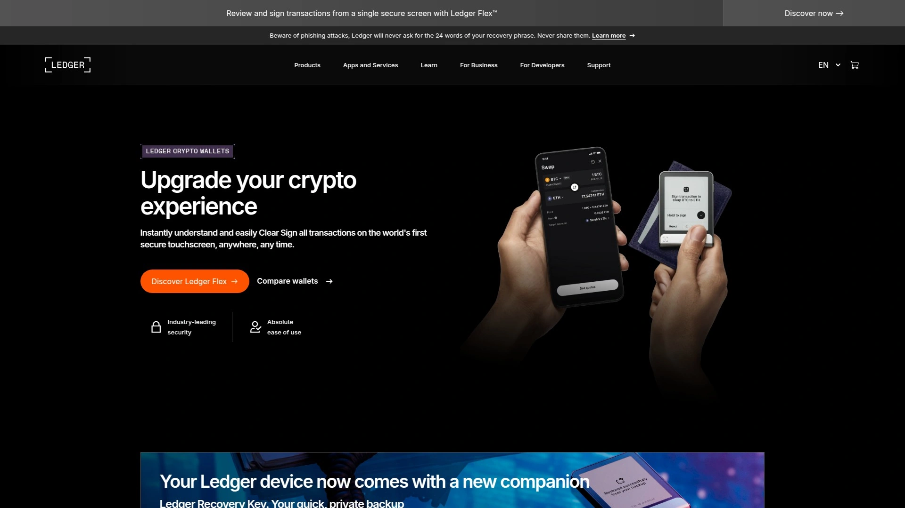
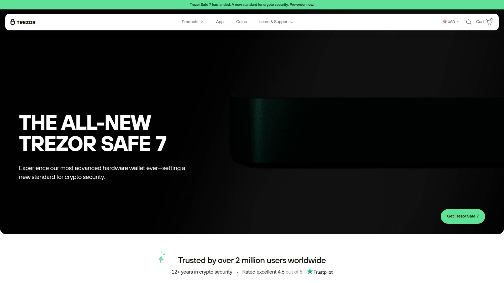
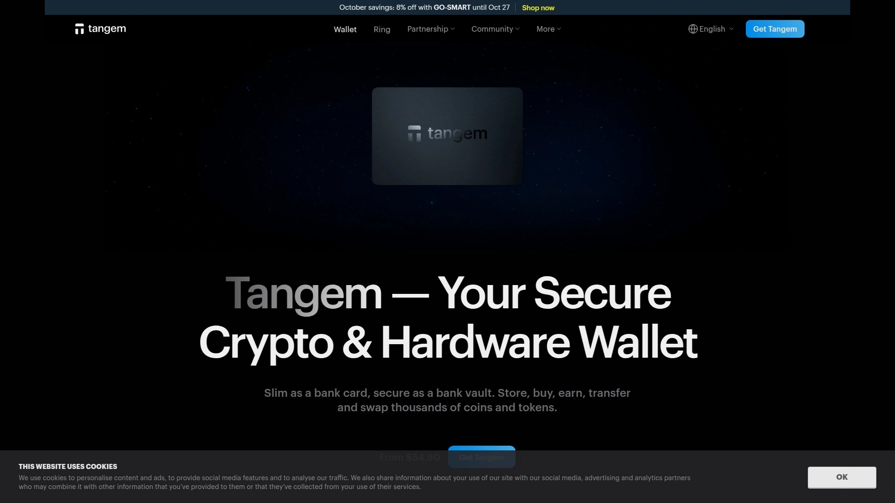
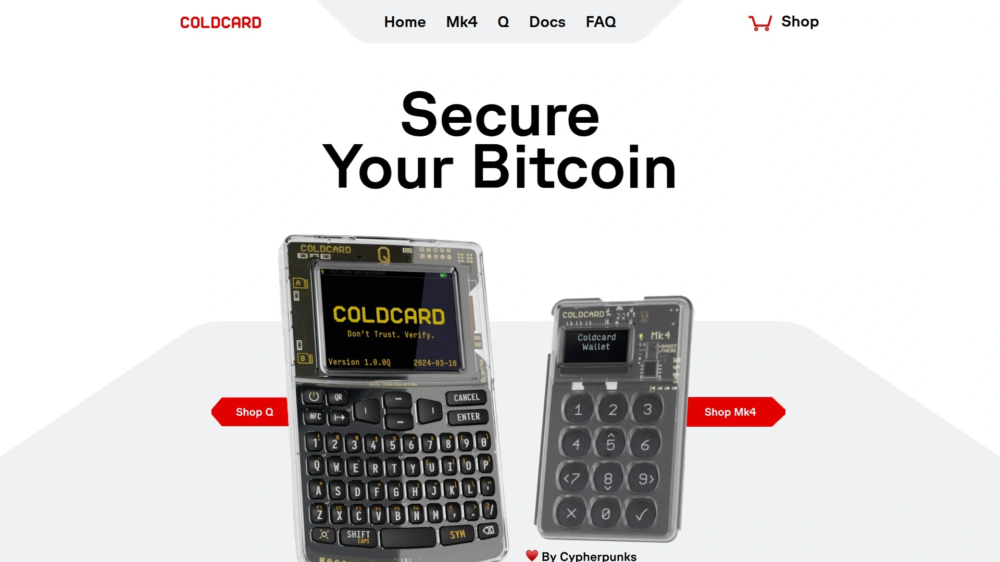
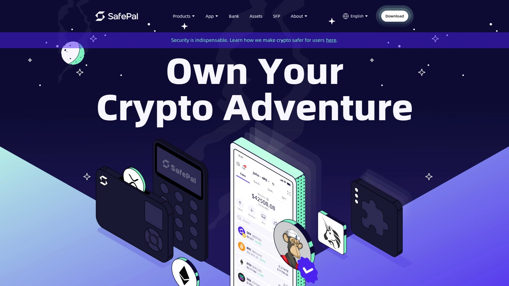
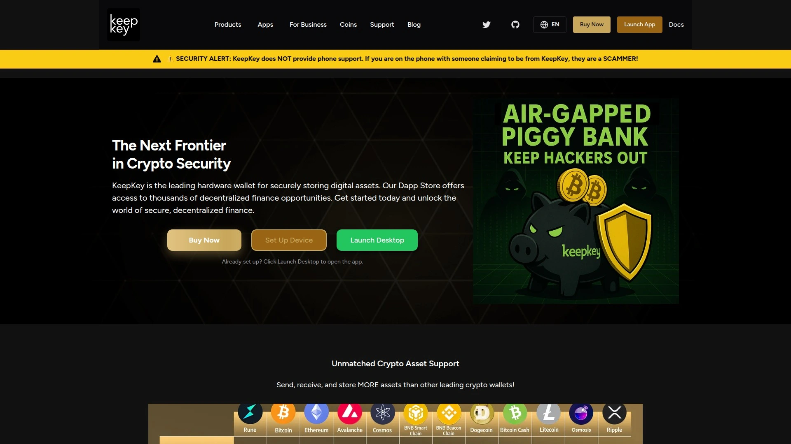
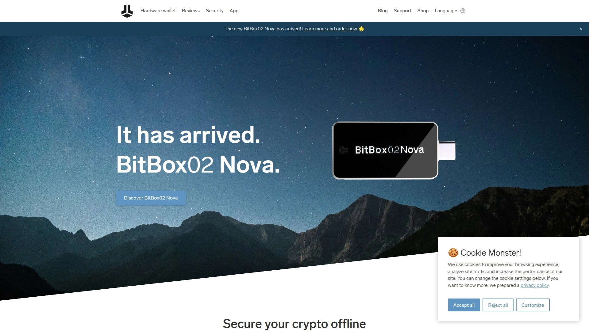
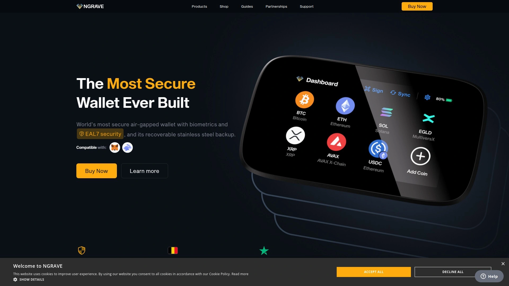

# Latest Hardware Crypto Wallet Roundup (Including Security Features)

Protecting cryptocurrency requires more than memorizing passwords—you need physical devices keeping private keys completely offline where hackers can't reach them. Hardware wallets solve the fundamental security problem: internet-connected devices get compromised, but cold storage remains immune to remote attacks. These specialized devices handle everything from Bitcoin to thousands of altcoins, signing transactions offline then broadcasting through companion apps. The right hardware wallet balances bulletproof security with actual usability, because a device too complex to use defeats its own purpose.

## **[Ledger](https://www.ledger.com)**

Secure Element protection managing 5,500+ cryptocurrencies seamlessly.

Ledger built its reputation on banking-grade security through certified Secure Element chips—the same tamper-proof technology protecting credit cards and passports. This specialized hardware stores private keys in isolated environments resistant to physical and digital attacks. The custom operating system runs apps in completely separated containers, preventing any single compromised app from accessing your entire portfolio.

Four device options cater to different needs and budgets. Nano S Plus handles essential cold storage affordably with larger memory supporting more simultaneous apps. Nano X adds Bluetooth connectivity for mobile management without sacrificing security, pairing exclusively with the official Ledger Live app through encrypted channels. Ledger Flex introduces a touchscreen interface simplifying navigation and transaction verification. Ledger Stax features an E Ink curved screen visible even when locked, displaying your NFT collection or custom designs.

The Ledger Live companion software centralizes portfolio management across desktop and mobile platforms. You track balances, send and receive crypto, stake coins for passive income, swap between assets, and access DeFi protocols through WalletConnect integration. The interface connects directly with exchanges like Coinify and MoonPay for purchasing crypto with fiat currency. Each transaction requires physical confirmation on the device screen, preventing unauthorized transfers even if your computer gets infected with malware.

Recovery relies on a 24-word backup phrase generated during initial setup. This phrase reconstructs your entire wallet on replacement devices if yours gets lost, stolen, or damaged. Ledger emphasizes writing this phrase on provided recovery sheets and storing them securely offline—never photographing or storing digitally. The ecosystem supports Bitcoin, Ethereum, all ERC-20 tokens, Cardano, Solana, Polygon, and thousands more. Pricing starts around $79 for Nano S Plus, scaling to premium options exceeding $150 depending on features and capacity.

## **[Trezor](https://trezor.io)**

Open-source hardware wallet pioneer with transparent security.

Trezor created the original hardware wallet concept back in 2014, establishing industry standards others follow. The company maintains completely open-source firmware and hardware designs, allowing independent security researchers to audit every code line. This transparency builds trust—you're not taking Trezor's word about security, you're trusting code verified by the global cryptography community.

The Model T features a color touchscreen eliminating the need for physical buttons during PIN entry and passphrase creation. You type directly on the device screen rather than using computer keyboards potentially infected with keyloggers. The interface supports over 1,800 cryptocurrencies including Bitcoin, Ethereum, Litecoin, and countless ERC-20 tokens. Built-in Tor integration routes traffic through anonymous networks for enhanced privacy during transactions.

The Safe series represents Trezor's latest evolution with improved hardware specifications. Safe 3 targets budget-conscious users wanting essential security without premium features. Safe 5 adds more storage, faster processors, and color touchscreen interfaces for smoother operation. Every model generates 12 or 24-word recovery seeds securing your assets even if the device fails or gets confiscated. Shamir Backup splits your seed into multiple shares requiring threshold combinations to recover wallets, protecting against single points of failure.

Trezor Suite software manages all device interactions through desktop or web interfaces. The platform handles portfolio tracking, transaction management, exchange integrations, and advanced features like coin control for privacy-conscious Bitcoin users. The password manager functionality securely stores website credentials encrypted by your device. Device authentication uses your Trezor for secure two-factor authentication on compatible websites. Prices range from approximately $69 for entry models to $169 for advanced touchscreen versions with maximum security features.

## **[Tangem](https://tangem.com)**

Card-format hardware wallets working entirely through NFC taps.

Tangem reimagines hardware wallet form factors through credit card-sized devices powered entirely by NFC technology. No screens, no buttons, no batteries, no charging cables—just tap your smartphone and manage crypto through the companion app. This radical simplification eliminates electronic components that could fail while maintaining security through EAL6+ certified chips meeting biometric passport standards.

Each card contains a secure microprocessor generating and storing private keys that never leave the chip. The NFC communication occurs through encrypted channels preventing man-in-the-middle attacks. Cards are waterproof, dustproof, and virtually indestructible compared to traditional electronic hardware wallets with screens and circuit boards vulnerable to physical damage. You receive backup cards during purchase, each containing identical cryptographic material ensuring recovery if you lose or damage your primary card.

The Tangem Wallet app handles all blockchain interactions—viewing balances, sending transactions, receiving payments, staking coins, accessing DeFi applications through WalletConnect. The platform supports over 6,000 cryptocurrencies including Bitcoin, Ethereum, Binance Smart Chain, Cardano, Solana, Polygon, and comprehensive token support. Built-in exchange features let you swap between assets directly within the app through integrated liquidity providers.

Setup takes minutes without complicated procedures. Download the app, tap your card, create your wallet, and start using it immediately. The app generates user-friendly backup options including cloud backups protected by biometric authentication on your phone. Transaction confirmation requires physically tapping the card against your device, preventing remote authorization even if someone compromises your phone. Cards cost around $50-70 depending on quantity purchased, with multi-card backup sets providing redundancy for peace of mind.

## **[Coldcard](https://coldcard.com)**

Bitcoin-focused air-gapped wallet for maximum security.

Coldcard specializes exclusively in Bitcoin security, refusing feature creep that introduces attack vectors. This singular focus allows extremely hardened implementations optimized for one cryptocurrency. The device operates completely air-gapped—meaning zero direct connection to internet-connected computers. All communication happens through microSD cards or QR codes, eliminating USB-based attack vectors.

The Mk4 model includes a secure element chip plus a second microprocessor providing dual-chip security. Even if attackers compromise one chip, the other maintains protection. Physical security features include anti-tamper meshes detecting case opening and secure boot verification ensuring firmware hasn't been modified. Advanced users appreciate features like brick-me PINs that permanently destroy the device if someone attempts forced access under duress.

MicroSD cards handle wallet exports, PSBT signing, and firmware updates without ever connecting to potentially compromised computers. You create unsigned transactions on internet-connected software wallets like Sparrow or Electrum, save them to microSD, sign offline on Coldcard, then broadcast the signed transaction. This workflow provides maximum security for large Bitcoin holdings where convenience matters less than absolute safety.

The interface relies on number pad entry and small OLED screens showing transaction details. The learning curve runs steeper than consumer-friendly options but appeals to sovereignty-minded Bitcoin holders prioritizing security over simplicity. Coldcard supports advanced features like multisignature wallets, custom derivation paths, and extensive transaction verification. The Coldcard Q adds QR code scanning, larger screens, and QWERTY keyboards for improved usability while maintaining air-gapped operation. Prices range from $150-280 depending on model, positioning Coldcard as premium security for serious Bitcoin investors.

## **[SafePal](https://www.safepal.com)**

Budget-friendly hardware wallet with comprehensive mobile features.

SafePal delivers hardware wallet security at accessible prices starting around $50, making cold storage available to users avoiding $100+ devices. The S1 model features a color touchscreen, camera for QR code scanning, and battery power allowing truly mobile operation without tethering to computers. This portability suits users managing crypto primarily through smartphones.

The device communicates exclusively through QR codes with the SafePal mobile app, maintaining air-gapped security. You scan QR codes to transmit unsigned transactions from your phone to the device, confirm on the hardware wallet screen, then scan the signed transaction back to your phone for broadcasting. This visual communication method prevents malware on phones from accessing private keys stored on the offline device.

SafePal supports over 30,000 cryptocurrencies through integration with major blockchains—Bitcoin, Ethereum, Binance Smart Chain, Solana, Polygon, Cardano, and countless tokens. The app provides full DeFi access through WalletConnect integration, exchange features through aggregated liquidity, NFT management, and staking capabilities. The security chip carries EAL5+ certification, among the highest standards for consumer electronics.

Built-in self-destruct mechanisms protect against physical tampering attempts. If someone opens the case or tries extracting the chip, the device automatically erases private keys. Recovery seed phrases use standard BIP39 mnemonics compatible with other wallets if you decide to switch hardware later. The large touchscreen and intuitive menu system make SafePal particularly accessible for first-time hardware wallet users intimidated by complicated devices. Support includes video tutorials, detailed documentation, and responsive customer service teams.

## **[KeepKey](https://keepkey.com)**

Large-screen hardware wallet with integrated exchange capabilities.

KeepKey distinguishes itself through a noticeably larger OLED display showing complete cryptocurrency addresses without scrolling. This screen size reduces verification errors when confirming transactions—you see entire addresses at once rather than abbreviated versions potentially hiding manipulation by malware. The premium aluminum body and minimalist design emphasize durability and aesthetics.

The device connects via USB to desktop computers running the KeepKey Client software or ShapeShift platform. Native integration with Thorchain enables decentralized cryptocurrency swaps directly from the hardware wallet interface. You exchange between supported assets without transferring to centralized exchanges, maintaining custody throughout the swap process. This embedded functionality simplifies trading while preserving security.

KeepKey supports over 40 major cryptocurrencies including Bitcoin, Ethereum, Litecoin, Dogecoin, Dash, and numerous ERC-20 tokens. The straightforward backup and recovery process generates 12-word recovery sentences during initialization, compatible with BIP39 standards. These phrases restore wallets on replacement devices or migrate assets to different hardware wallets if needed. PIN protection requires manual confirmation for every transaction using the device's physical button.

Setup takes minimal time through guided wizards walking users through initialization, backup creation, and first transaction. The larger form factor means KeepKey doesn't fit in wallets like smaller devices but provides better user experience through generous screen real estate. The platform appeals to users wanting hardware security without sacrificing trading convenience. Founded after the Mt. Gox breach specifically to improve cryptocurrency custody, KeepKey maintains a security-first philosophy while addressing usability pain points that intimidate mainstream adoption.

## **[BitBox02](https://bitbox.swiss)**

Swiss-engineered minimalist wallet emphasizing simplicity and security.

BitBox02 embodies Swiss design principles—minimal, functional, secure. The device features an OLED display and touch sensors enabling gesture-based navigation without physical buttons. You slide your finger to scroll through menus and confirm actions, creating an intuitive interface requiring no instruction manuals. The USB-C connection works with both desktop and mobile devices through USB adapters.

The platform offers two versions: a multi-currency edition supporting Bitcoin, Litecoin, Ethereum, Cardano, and 1,500+ ERC-20 tokens, plus a Bitcoin-only edition with reduced firmware attack surface. Less code means fewer potential vulnerabilities, making the Bitcoin-only version ideal for users holding exclusively BTC who want maximum security through minimal complexity. Both versions use the same hardware with different firmware loads.

Automatic backup to included microSD cards eliminates manual seed phrase recording prone to errors. The device generates your recovery seed and writes it encrypted to the card, providing simple backup restoration without transcription mistakes. You still receive the standard BIP39 recovery phrase for compatibility with other wallets. Advanced privacy features include connecting to personal Bitcoin nodes, coin control for selecting specific UTXOs, and Tor integration routing traffic anonymously.

The companion BitBoxApp manages all wallet functions through clean desktop interfaces. Open-source code undergoes regular security audits from independent researchers verifying safety claims. Swiss manufacturing emphasizes quality control and supply chain security, reducing risks of compromised components during production. The platform appeals to privacy-conscious users wanting sophisticated features packaged in beginner-friendly interfaces. Prices run approximately $150, positioning BitBox02 as premium hardware delivering professional-grade security with consumer-friendly usability.

## **[Ngrave Zero](https://www.ngrave.io)**

Air-gapped wallet with the highest security certification in the industry.

Ngrave Zero achieves EAL7 certification—the absolute highest security rating for consumer electronics, exceeding even military-grade standards. No other hardware wallet reaches this certification level. The device features a large color touchscreen, built-in camera for QR code signing, and biometric fingerprint authentication adding an extra security layer beyond PIN codes.

Complete air-gap operation means zero physical connections to computers or phones—all communication happens through QR codes. The camera scans unsigned transactions displayed by the Ngrave Liquid companion app, you verify and sign on the device screen, then scan the signed transaction back to broadcast. This workflow eliminates any wired or wireless attack vectors exploiting physical connections between devices.

The device arrives with Ngrave Graphene backup plates—stainless steel puzzle pieces you assemble and store separately. These indestructible metal backups survive fire, flood, corrosion, and physical damage that would destroy paper seed phrases. The puzzle design prevents casual discovery while remaining human-readable when assembled. Your recovery seed never displays as plain text, only as QR codes preventing shoulder surfing during backup procedures.

Ngrave Zero supports Bitcoin, Ethereum, and hundreds of cryptocurrencies through integration with major blockchain networks. The premium positioning reflects in pricing around $400, targeting users protecting substantial holdings where security justifies investment. The sleek industrial design, intuitive touchscreen interface, and comprehensive security features make Ngrave Zero the choice for high-net-worth individuals, institutional custody, and paranoid security enthusiasts refusing compromises. The completely offline nature and military-grade protection provide ultimate peace of mind for long-term cold storage.

***

## FAQ

**How do hardware wallets actually protect cryptocurrency better than software wallets or exchange storage?**

Hardware wallets store private keys on specialized chips physically isolated from internet-connected computers. When you initiate transactions, the hardware device signs them internally without exposing keys to your potentially compromised computer. Exchanges control your private keys, making you vulnerable to platform hacks, exit scams, or seizures. Software wallets store keys on internet-connected devices exposed to malware. Hardware wallets eliminate these attack vectors through air-gapped or encrypted communication, requiring physical device access and PIN codes for unauthorized transactions. [Ledger](https://www.ledger.com) uses banking-grade Secure Element chips specifically designed to resist physical and remote tampering attempts.

**What happens if I lose my hardware wallet or it breaks—do I lose all my cryptocurrency forever?**

No, your crypto remains safe through recovery seed phrases generated during initial setup. These 12-24 word phrases mathematically reconstruct your private keys on replacement devices or compatible wallets. Write down your recovery phrase on paper, store it securely offline, and you can recover everything even if your hardware wallet gets destroyed, lost, or stolen. The phrase represents your actual wallet—the physical device simply provides secure access to it. However, anyone obtaining your recovery phrase controls your funds, so protect it like cash.

**Can hardware wallets handle all the cryptocurrencies I own or do I need multiple devices?**

Most modern hardware wallets support thousands of cryptocurrencies through native integration or third-party wallet software. Platforms like Ledger and Trezor handle Bitcoin, Ethereum, and virtually all major altcoins plus countless tokens built on popular blockchains. Bitcoin-focused options like Coldcard sacrifice altcoin support for enhanced Bitcoin security. Check specific device specifications before purchasing to confirm your holdings are supported. Many users own multiple hardware wallets for diversification—segregating assets across devices reduces single points of failure while providing backup options.

---

## Conclusion

Hardware wallets represent the gold standard for cryptocurrency security when you're protecting anything beyond casual amounts. [Ledger](https://www.ledger.com) stands out for comprehensive asset support across 5,500+ cryptocurrencies, bank-grade Secure Element protection, intuitive Ledger Live software, and multiple device options matching different budgets and use cases—the combination of bulletproof security with genuine usability makes it particularly suitable for users wanting maximum protection without sacrificing convenient portfolio management. Choose hardware wallets matching your specific needs around supported currencies, desired features, and comfort with technical complexity, then protect those recovery phrases like your financial life depends on them—because it does.
